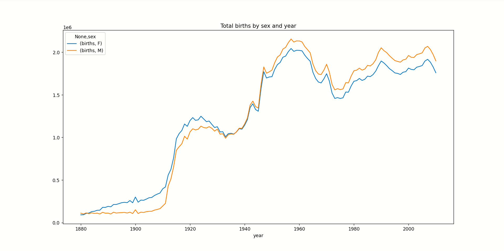
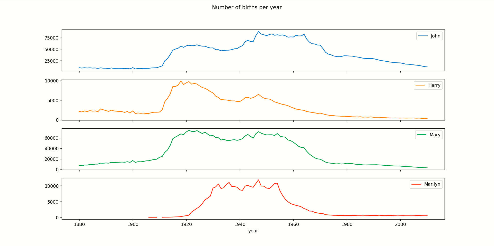
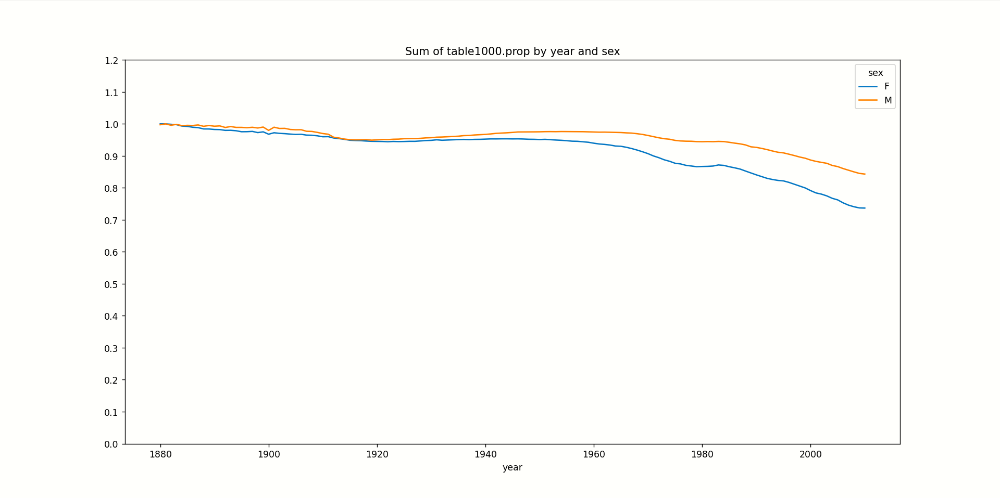
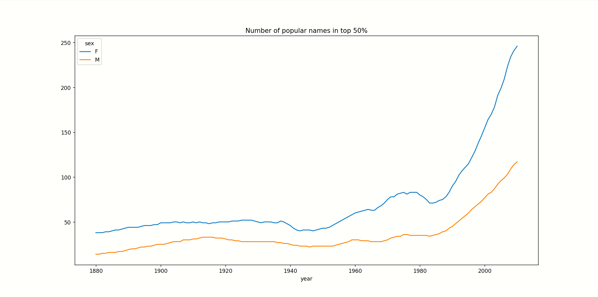

# 分析流程
数据内容为：
```python
names1880:
           name sex  births
0          Mary   F    7065
1          Anna   F    2604
2          Emma   F    2003
3     Elizabeth   F    1939
4        Minnie   F    1746
...         ...  ..     ...
1995     Woodie   M       5
1996     Worthy   M       5
1997     Wright   M       5
1998       York   M       5
1999  Zachariah   M       5

[2000 rows x 3 columns]
```
一份关于每年出生人口名字的数据集。可以以此来分析：
- 每年出生人口
- 热门名字的历史变迁
- 前1000个名字所占人口比例
- 名字的多样程度
## 分析出生人口数量
- 为了将所有数据集中分析，首先将所有数据汇总到一张表
- 用透视表，以年份为行索引，性别为列索引，把组内的出生数据进行加总，得到以下数据：
```python
names_pivot_year_sex(每年出生男女）:
       births         
sex         F        M
year                  
1880    90993   110493
1881    91955   100748
1882   107851   113687
1883   112322   104632
1884   129021   114445
...       ...      ...
2006  1896468  2050234
2007  1916888  2069242
2008  1883645  2032310
2009  1827643  1973359
2010  1759010  1898382

[131 rows x 2 columns]
```
以此作图，得到男女出生人口随时间变化的曲线：

## 热门名字的历史变迁
- 以年份和性别分组，并进行排序，拿出每个组前1000个名字
- 再以年份和姓名作为行和列索引做透视表，加总每个组的的人数，即可以按列取一系列人名岁时间的频数变化：

## 分析前1000个名字的多样性
- 用之前的“以年份和性别分组，并进行排序，拿出每个组前1000个名字”的数据，加总以年份和性别分组，这1000个所占的比例的值（由于之前也算过每个名字占当年总出生数的比例）
- 作图

## 分析前50%人数的名字的多样程度
- 用cumsum函数加总排序后每个组的每个名字的比例
- 用searchsorted找到50%分位的位置，得到每个组的人数
- 返回的数据带上索引：
```python
diversity:
sex     F    M
year          
1880   38   14
1881   38   14
1882   38   15
1883   39   15
1884   39   16
...   ...  ...
2006  209   99
2007  223  103
2008  234  109
2009  241  114
2010  246  117
```
以此作图：



# 注意事项
## DataFrameGroupBy无法使用sort_values,也没有.columns
因为一旦sort_values，分组也就失去意义了，如`top1000_ey_by_s=names.groupby(['year','sex']).sort_values('births',ascending=False)[:1000]`

因此，要实现 “分组内排序”，你需要使用 apply 函数，将排序操作应用到每个分组上后再排序