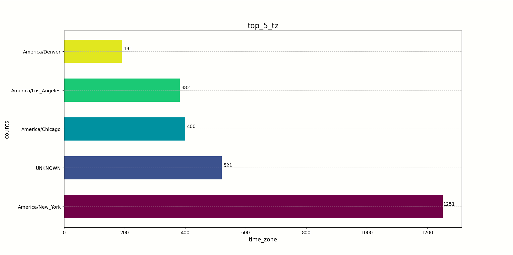
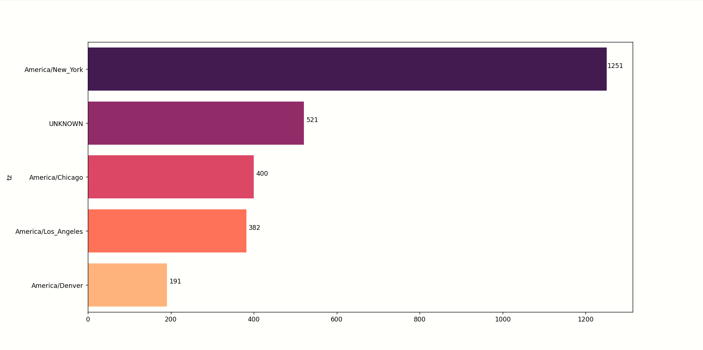
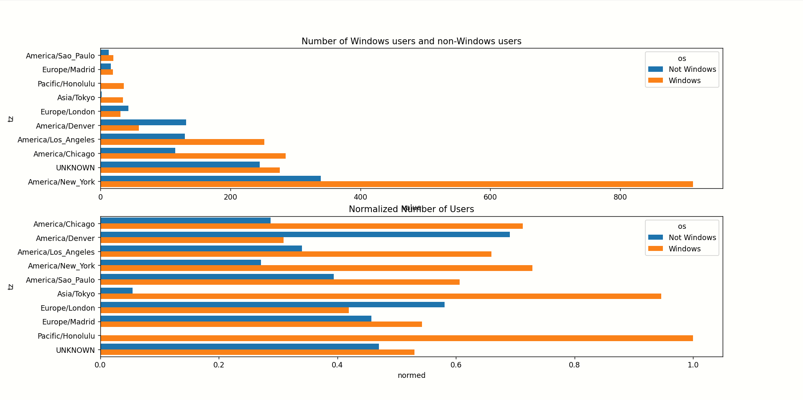
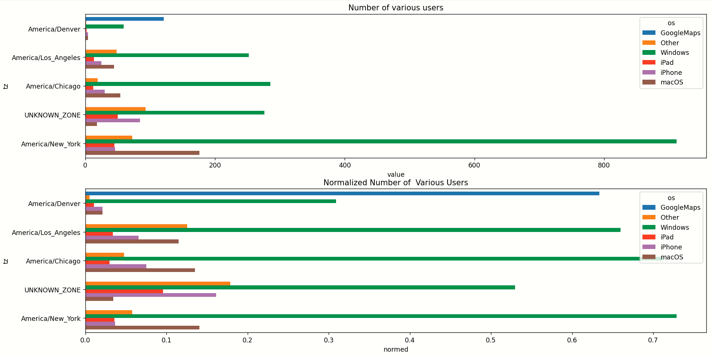

# 分析流程
## 1. 导入文件
是个txt文件，数据格式是json，需要用json库读取为python字典，然后把数据导入一个dataframe对象
## 2. 分析时区分布
- 观察到时区是有空的和有缺失的，所以需要处理这部分数据
- 画出5个最多时区的柱状图
- 加上数量标注
## 3. 分析Windows、非Windows用户分布
- 观察标识，发现很多Windows用户，先初步分析Windows用户和其它用户的占比
- 新增一列，判断用户系统
- 根据时区、系统分组并查看每组大小
- 先重新设置索引，把数据变为长格式，才能让柱状图对应上
- 画图
- 数据标准化画图二
## 4. 用类似的方法分析Windows、iPhone等用户 
## 5. 结果







# 新应用
## json数据
- `json.loads(line)` 将每行 JSON 字符串转换为 Python 字典或列表
- `json.dumps()` 将这个字典转换为 JSON 字符串
- `ensure_ascii=False`允许非 ASCII 字符（如中文）直接显示
## matplotlib柱状图颜色
1. plt.cm.viridis：选择一个颜色映射方案
- plt.cm：Matplotlib 的 colormap（颜色映射） 模块，里面有很多预设的颜色方案。
- viridis：其中一个非常常用的颜色方案，从黄色平滑过渡到青色再到紫色。并且在黑白打印时也能保持良好的区分度。 你也可以换成其他方案，比如 plasma, magma, inferno, jet (不推荐), rainbow (不推荐) 等。
2. np.linspace(0, 1, len(subset))：生成一组均匀分布的数字
- np.linspace(start, stop, num)：NumPy 的函数，用于生成一个等差数列。
0, 1：数列的起点和终点。
- len(subset)：数列的数量。自动根据数据的数量生成需要的颜色数量。
- 作用：生成一组从 0 到 1 之间、数量为 len(subset) 的均匀分布的数字。例如，如果 subset 有 5 个元素，它会生成 [0. , 0.25, 0.5 , 0.75, 1. ]。
3. 组合起来：`colors = plt.cm.viridis(np.linspace(0, 1, len(subset)))`
plt.cm.viridis 不仅是一个颜色方案的名字，它还是一个函数。
当你把 np.linspace 生成的数字（比如 [0, 0.25, 0.5, 0.75, 1]）传给这个函数时，它会返回对应位置的颜色。
0 对应 viridis 颜色条的最左端（黄色）。
1 对应颜色条的最右端（紫色）。
0.5 对应中间的青色。
所以，colors 最终会是一个列表，里面包含了 len(subset) 个从黄到紫的、均匀过渡的颜色值。
## 控制pandas数据的显示
```commandline
pd.set_option('display.width', 1000)  # 根据实际情况调整宽度值
pd.set_option('display.max_columns', None)  # 显示所有列
pd.set_option('display.max_colwidth', None)#控制dataframe的列宽
pd.set_option('display.colheader_justify', 'left')
#display.colheader_justify 只控制列名的对齐方式，而数据内容默认就是左
对齐的。如果你发现某些列右对齐，可能是因为它们是数值类型，
可以用 df.style 来单独调整。
# 使用 Styler 让所有列左对齐
df.style.set_properties(**{'text-align': 'left'})

# 或者只让某一列左对齐
df.style.set_properties(subset=['列名'], **{'text-align': 'left'})
```
## 字符串筛选条件
- `cframe["a"].str.contains("Windows")`
- 
```commandline
conditions = [
    cframe2["a"].str.contains("Windows", case=False), # case=False 表示不区分大小写
    cframe2["a"].str.contains("iPhone", case=False),
    cframe2["a"].str.contains("iPad", case=False),
    cframe2["a"].str.contains("GoogleMaps/RochesterNY", case=False),
    cframe2["a"].str.contains("Macintosh", case=False)
]
# 2. 定义与条件对应的结果列表
choices = [
    "Windows",
    "iPhone",
    "iPad",
    "GoogleMaps",
    "macOS"
]
# 3. 使用 np.select() 进行判断
#    - 如果条件1满足，赋值"Windows"
#    - 如果条件1不满足但条件2满足，赋值"iPhone"
#    - ...以此类推
#    - 如果所有条件都不满足，则赋值"Other"
cframe2['os'] = np.select(conditions, choices, default='Other')
```
## dataframe的argsort()方法

argsort() 返回的是 “排序后的元素在原始数组中的索引位置”，而不是元素值本身。
如下列代码是返回行求和后最大的10个结果：
```commandline
indexer=agg_counts.sum('columns').argsort()
count_subset=agg_counts.take(indexer[-10:])
```
## 改某个索引名称或值数据：
-该索引`count_subset.rename(index={"":'UNKNOWN'},inplace=True)`
## pd.melt的参数
-
```commandline
pd.melt(frame, id_vars=None, value_vars=None, var_name='variable', value_name='value', col_level=None)
```
- id_vars (关键参数)
作用：“身份” 变量或 **“标识符” 变量 **。这些列在转换后保持不变，不会被 “融合”。它们是数据的锚点。
- value_vars
作用：指定要被 “融合” 的列。如果不指定，默认是除了 id_vars 之外的所有列。
- var_name
作用：给新生成的、包含原始列名的那个列起一个名字。默认名为 'variable'。
- value_name
作用：给新生成的、包含原始值的那个列起一个名字。默认名为 'value'。
# 注意事项
1. 空字符串 "" 和缺失值 NaN 是两种完全不同的东西。Pandas 默认不会把空字符串 "" 自动识别为缺失值 NaN。
```
data = [
    {"tz": "America/New_York"},  # 正常值
    {"tz": ""},                  # 空字符串
    {"tz": None},                # Python的None值
    {}                           # 字段完全缺失
]
```
对于 {"tz": ""}：这是一个明确的、有值的字段，它的值就是长度为 0 的字符串。
Pandas 会忠实地记录这个值，它不会把它转换成 NaN。
对于 {"tz": None} 和 {}：这两种情况代表了 “此处没有值”。
Pandas 会将其识别为缺失值，并在 DataFrame 中用 NaN (Not a Number) 来表示。

2. 作几个分类的柱状图是，字符作为坐标，底层数据的数字从0，1，2，3开始。`enumerate()` 是 Python 里一个非常实用的内置函数，它的核心作用是：
在遍历列表、元组或其他可迭代对象时，同时获取 “索引” 和 “值”。
对于
```commandline
for i, value in enumerate(subset.values):
    ax3.text(value + 20, i, str(value), ha='center', va='bottom')
```
i分别是0，1，2，3，4，5。这样就正好获得各个标签的坐标

另外，seaborn也可用同一套注释方法
3. frame[['a']][0:30]和frame['a'][0:30]不一样。[[]]返回dataframe数据，[]只返回series数据
4. 当你在 GroupBy 对象上调用一个聚合函数时，Pandas 才会真正执行分组和计算
5. dataframe 的.value_counts()和.size()的区别
- .value_counts()：是一个Series 方法，用来计算一个列表（或一列数据）中每个唯一值出现了多少次。
- .size() 方法一个分组（groupby）之后才能用的方法。它计算每个分组的大小（即每个组有多少行）。使用对象是GroupBy 对象。所以只要groupby分好组，原始数据的其他列就不用管。
6. dataframe的apply
- 当你直接在一个 DataFrame 上调用 apply 时，默认情况 (axis=0)：按列处理。函数会接收到每一列（一个 Series）作为参数。 axis=1：按行处理。函数会接收到每一行（一个 Series）作为参数。
- 在 GroupBy 对象上使用 apply
当你对 groupby 的结果使用 apply 时，行为就变成了逐组处理。 apply 会遍历每个分组，然后： 把每个分组的数据（一个完整的 DataFrame）作为参数，传递给你指定的函数。 最后，apply 会把所有分组函数的返回值智能地组合起来，形成一个最终的结果。
7. 使用transform
-注意要明确传入的是哪一列
```python
top_5_zone_melt['normed']=top_5_zone_melt['value']/top_5_zone_melt.groupby('tz')['value'].transform('sum')
```
8. 链式索引问题
- 副本（Copy）：你把原始表格完整复印了一份，拿到了一张独立的纸。之后你在这张复印件上写字、修改，哪怕涂得乱七八糟，原始表格完全不会变—— 因为两者是独立的。
- 视图（View）：你没有复印，而是在原始表格上放了一个 “窗户”（比如一张挖了洞的纸）。透过窗户你只能看到表格的一部分（比如前 5 行、某几列），但你看到的内容本质还是原始表格的内容。这时候如果你在 “窗户里” 改内容（比如把某个数字涂掉重写），就会出现一个问题：你到底是想改 “窗户里的影像”，还是想改 “原始表格上的对应位置”？

当你用类似 `top_5_zone=gourped_tz_os_unstack.iloc[indexer2[-5:],:] `这种 “链式索引” 筛选数据时，Pandas 不会立刻复制一份新数据（副本），而是先返回一个 “视图”—— 相当于给原始数据开了个 “窗户”，让你看到筛选后的部分。
这时候问题就来了：当你执行 `top_5_zone['total']=top_5_zone.sum(axis=1)` 时，Pandas 懵了：“你到底想改这个‘窗户’（视图）里的内容，还是想通过‘窗户’改原始数据（original_df）里的内容？”因为两种操作的结果完全不同（改副本不影响原件，改视图可能影响原件），Pandas 无法确定你的意图，为了避免你误改原始数据，就会抛出那个警告，逼你用更明确的方式告诉它 “你要改的到底是什么”。
- 总结：别用 “链式索引” 筛选数据：比如 df[A][B] 这种写法（先选行再选列），容易生成视图；改用 df.loc[行条件, 列名]，直接生成副本，一步到位。
不确定时就加 .copy()：如果不知道 top_5_zone 是视图还是副本，在创建后加个 .copy()（比如 top_5_zone = top_5_zone.copy()），强制变成独立副本，后续修改就安全了。