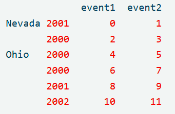

# 分析流程
## 1. 观察数据包含的信息
  ```
  users.head():
   user_id gender  age  occupation    zip
0        1      F    1          10  48067
1        2      M   56          16  70072
2        3      M   25          15  55117
3        4      M   45           7  02460
4        5      M   25          20  55455
ratings.head():
   user_id  movie_id  rating  timestamp
0        1      1193       5  978300760
1        1       661       3  978302109
2        1       914       3  978301968
3        1      3408       4  978300275
4        1      2355       5  978824291
movies.head():
   movie_id                               title                        genres
0         1                    Toy Story (1995)   Animation|Children's|Comedy
1         2                      Jumanji (1995)  Adventure|Children's|Fantasy
2         3             Grumpier Old Men (1995)                Comedy|Romance
3         4            Waiting to Exhale (1995)                  Comedy|Drama
4         5  Father of the Bride Part II (1995)                        Comedy
  ```
  其中有年龄、性别、用户id、电影名称、对电影的评价、电影所属的类别。
  那么从众可以分析男女评分的差异和喜好差异，也可以对各个年龄段的喜好进行分析
## 分析性别的喜好差异
- 合并数据。将三张表的数据合并，以整合用户、评分、电影信息等。整合表结构为：

```
data.head(20):
    user_id  movie_id  rating  timestamp gender  age  occupation    zip                                   title                              genres
0         1      1193       5  978300760      F    1          10  48067  One Flew Over the Cuckoo's Nest (1975)                               Drama
1         1       661       3  978302109      F    1          10  48067        James and the Giant Peach (1996)        Animation|Children's|Musical
2         1       914       3  978301968      F    1          10  48067                     My Fair Lady (1964)                     Musical|Romance
3         1      3408       4  978300275      F    1          10  48067                  Erin Brockovich (2000)                               Drama
4         1      2355       5  978824291      F    1          10  48067                    Bug's Life, A (1998)         Animation|Children's|Comedy
5         1      1197       3  978302268      F    1          10  48067              Princess Bride, The (1987)     Action|Adventure|Comedy|Romance
6         1      1287       5  978302039      F    1          10  48067                          Ben-Hur (1959)              Action|Adventure|Drama
7         1      2804       5  978300719      F    1          10  48067               Christmas Story, A (1983)                        Comedy|Drama
8         1       594       4  978302268      F    1          10  48067  Snow White and the Seven Dwarfs (1937)        Animation|Children's|Musical
9         1       919       4  978301368      F    1          10  48067                Wizard of Oz, The (1939)  Adventure|Children's|Drama|Musical
10        1       595       5  978824268      F    1          10  48067             Beauty and the Beast (1991)        Animation|Children's|Musical
11        1       938       4  978301752      F    1          10  48067                             Gigi (1958)                             Musical
12        1      2398       4  978302281      F    1          10  48067           Miracle on 34th Street (1947)                               Drama
13        1      2918       4  978302124      F    1          10  48067         Ferris Bueller's Day Off (1986)                              Comedy
14        1      1035       5  978301753      F    1          10  48067              Sound of Music, The (1965)                             Musical
15        1      2791       4  978302188      F    1          10  48067                        Airplane! (1980)                              Comedy
16        1      2687       3  978824268      F    1          10  48067                           Tarzan (1999)                Animation|Children's
17        1      2018       4  978301777      F    1          10  48067                            Bambi (1942)                Animation|Children's
18        1      3105       5  978301713      F    1          10  48067                       Awakenings (1990)                               Drama
19        1      2797       4  978302039      F    1          10  48067                              Big (1988)                      Comedy|Fantasy

```
  这样，就得到所有人对所有已评分电影的分值、性别等信息
- 用透视表对打分进行聚合求平均值，行索引为电影名，列为男和女
  - 结果为：
```
mean_ratings_by_gender:
gender                                             F         M
title                                                         
$1,000,000 Duck (1971)                      3.375000  2.761905
'Night Mother (1986)                        3.388889  3.352941
'Til There Was You (1997)                   2.675676  2.733333
'burbs, The (1989)                          2.793478  2.962085
...And Justice for All (1979)               3.828571  3.689024
...                                              ...       ...
Zed & Two Noughts, A (1985)                 3.500000  3.380952
Zero Effect (1998)                          3.864407  3.723140
Zero Kelvin (Kjærlighetens kjøtere) (1995)       NaN  3.500000
Zeus and Roxanne (1997)                     2.777778  2.357143
eXistenZ (1999)                             3.098592  3.289086
```
- 为了保证评价的有效性，选择评价数量大于250个的电影名字，得到：
```python
active_titles:
Index([''burbs, The (1989)', '10 Things I Hate About You (1999)', '101 Dalmatians (1961)', '101 Dalmatians (1996)', '12 Angry Men (1957)', '13th Warrior, The (1999)', '2 Days in the Valley (1996)', '20,000 Leagues Under the Sea (1954)', '2001: A Space Odyssey (1968)', '2010 (1984)',
       ...
       'X-Men (2000)', 'Year of Living Dangerously (1982)', 'Yellow Submarine (1968)', 'You've Got Mail (1998)', 'Young Frankenstein (1974)', 'Young Guns (1988)', 'Young Guns II (1990)', 'Young Sherlock Holmes (1985)', 'Zero Effect (1998)', 'eXistenZ (1999)'], dtype='object', name='title', length=1216)

```
- 再用.loc取到这些电影经过透视表后的信息：
```python
active_titles_mr_gb_gender:
gender                                    F         M
title                                                
'burbs, The (1989)                 2.793478  2.962085
10 Things I Hate About You (1999)  3.646552  3.311966
101 Dalmatians (1961)              3.791444  3.500000
101 Dalmatians (1996)              3.240000  2.911215
12 Angry Men (1957)                4.184397  4.328421
...                                     ...       ...
Young Guns (1988)                  3.371795  3.425620
Young Guns II (1990)               2.934783  2.904025
Young Sherlock Holmes (1985)       3.514706  3.363344
Zero Effect (1998)                 3.864407  3.723140
eXistenZ (1999)                    3.098592  3.289086

```
而且稍微排一下序就能看到女性最爱电影的榜单：
```python
top_female_ratings:
gender                                                     F         M
title                                                                 
Close Shave, A (1995)                               4.644444  4.473795
Wrong Trousers, The (1993)                          4.588235  4.478261
Sunset Blvd. (a.k.a. Sunset Boulevard) (1950)       4.572650  4.464589
Wallace & Gromit: The Best of Aardman Animation...  4.563107  4.385075
Schindler's List (1993)                             4.562602  4.491415
...                                                      ...       ...
Avengers, The (1998)                                1.915254  2.017467
Speed 2: Cruise Control (1997)                      1.906667  1.863014
Rocky V (1990)                                      1.878788  2.132780
Barb Wire (1996)                                    1.585366  2.100386
Battlefield Earth (2000)                            1.574468  1.616949

```
- 通过计算男女对不同电影评分的分数差异，可以找出分数差异最大的一些电影：
```python
sorted_by_diff(女性喜欢男不喜欢）:
gender                                         F         M  abs_diff
title                                                               
Dirty Dancing (1987)                    3.790378  2.959596  0.830782
Jumpin' Jack Flash (1986)               3.254717  2.578358  0.676359
Grease (1978)                           3.975265  3.367041  0.608224
Little Women (1994)                     3.870588  3.321739  0.548849
Steel Magnolias (1989)                  3.901734  3.365957  0.535777
...                                          ...       ...       ...
Cable Guy, The (1996)                   2.250000  2.863787 -0.613787
Longest Day, The (1962)                 3.411765  4.031447 -0.619682
Dumb & Dumber (1994)                    2.697987  3.336595 -0.638608
Kentucky Fried Movie, The (1977)        2.878788  3.555147 -0.676359
Good, The Bad and The Ugly, The (1966)  3.494949  4.221300 -0.726351

[1216 rows x 3 columns]
sorted_by_diff(男性喜欢女不喜欢）:
gender                                         F         M  abs_diff
title                                                               
Good, The Bad and The Ugly, The (1966)  3.494949  4.221300 -0.726351
Kentucky Fried Movie, The (1977)        2.878788  3.555147 -0.676359
Dumb & Dumber (1994)                    2.697987  3.336595 -0.638608
Longest Day, The (1962)                 3.411765  4.031447 -0.619682
Cable Guy, The (1996)                   2.250000  2.863787 -0.613787
...                                          ...       ...       ...
Steel Magnolias (1989)                  3.901734  3.365957  0.535777
Little Women (1994)                     3.870588  3.321739  0.548849
Grease (1978)                           3.975265  3.367041  0.608224
Jumpin' Jack Flash (1986)               3.254717  2.578358  0.676359
Dirty Dancing (1987)                    3.790378  2.959596  0.830782

```
- 另外，通过计算男女对不同电影评分的排名差异，可以找出男女分歧最大的一些电影：
```python
排名差距最大的10部电影（女高男低）:
gender                                        F         M  abs_diff  rank_M  rank_F  rank_diff
title                                                                                         
Dirty Dancing (1987)                   3.790378  2.959596  0.830782    1058     435        623
Grease (1978)                          3.975265  3.367041  0.608224     804     250        554
Steel Magnolias (1989)                 3.901734  3.365957  0.535777     806     324        482
Little Women (1994)                    3.870588  3.321739  0.548849     837     364        473
Color Purple, The (1985)               4.158192  3.659341  0.498851     566     123        443
Guys and Dolls (1955)                  4.051724  3.583333  0.468391     626     194        432
Anastasia (1997)                       3.800000  3.281609  0.518391     862     431        431
Rocky Horror Picture Show, The (1975)  3.673016  3.160131  0.512885     958     539        419
Age of Innocence, The (1993)           3.827068  3.339506  0.487561     824     409        415
South Pacific (1958)                   3.887850  3.445087  0.442764     741     345        396
排名差距最大的10部电影（男高女低）:
gender                                         F         M  abs_diff  rank_M  rank_F  rank_diff
title                                                                                          
Kentucky Fried Movie, The (1977)        2.878788  3.555147 -0.676359     648    1089       -441
Akira (1988)                            3.511111  3.980344 -0.469233     249     693       -444
Animal House (1978)                     3.628906  4.167192 -0.538286     119     586       -467
Exorcist, The (1973)                    3.537634  4.067239 -0.529605     194     668       -474
Hidden, The (1987)                      3.137931  3.745098 -0.607167     468     978       -510
For a Few Dollars More (1965)           3.409091  3.953795 -0.544704     270     782       -512
Caddyshack (1980)                       3.396135  3.969737 -0.573602     255     795       -540
Longest Day, The (1962)                 3.411765  4.031447 -0.619682     220     777       -557
Evil Dead II (Dead By Dawn) (1987)      3.297297  3.909283 -0.611985     310     872       -562
Good, The Bad and The Ugly, The (1966)  3.494949  4.221300 -0.726351      89     706       -617

```
## 分析各年龄段喜好类别
- 首先需要把原本的分类拆解。因为原本一个电影的分类包含多个类别，拆分后：
```python
movies_exploded.head(10):
    movie_id                     title       genre
0         1          Toy Story (1995)   Animation
0         1          Toy Story (1995)  Children's
0         1          Toy Story (1995)      Comedy
1         2            Jumanji (1995)   Adventure
1         2            Jumanji (1995)  Children's
1         2            Jumanji (1995)     Fantasy
2         3   Grumpier Old Men (1995)      Comedy
2         3   Grumpier Old Men (1995)     Romance
3         4  Waiting to Exhale (1995)      Comedy
3         4  Waiting to Exhale (1995)       Drama
```
- 再将这张表与用户、评分表合并，得到更详细的类别信息：
```python
ratings_with_genre.head(10):
    movie_id             title      genre  user_id  rating  timestamp gender  age  occupation    zip
0         1  Toy Story (1995)  Animation        1       5  978824268      F    1          10  48067
1         1  Toy Story (1995)  Animation        6       4  978237008      F   50           9  55117
2         1  Toy Story (1995)  Animation        8       4  978233496      M   25          12  11413
3         1  Toy Story (1995)  Animation        9       5  978225952      M   25          17  61614
4         1  Toy Story (1995)  Animation       10       5  978226474      F   35           1  95370
5         1  Toy Story (1995)  Animation       18       4  978154768      F   18           3  95825
6         1  Toy Story (1995)  Animation       19       5  978555994      M    1          10  48073
7         1  Toy Story (1995)  Animation       21       3  978139347      M   18          16  99353
8         1  Toy Story (1995)  Animation       23       4  978463614      M   35           0  90049
9         1  Toy Story (1995)  Animation       26       3  978130703      M   25           7  23112

```
- 再对这张表的年龄作化分，将人群分位少年、青年、中年、老年,然后计算每个人群对每个分类的评分取平均：
```python
ratings_with_genre_pt.head(10):
age          teen      youth     middle    aged    
genre                                              
Action       3.506385  3.451342  3.550315  3.610709
Adventure    3.449975  3.431615  3.540507  3.649064
Animation    3.476113  3.671556  3.745436  3.756233
Children's   3.241642  3.374271  3.526917  3.621822
Comedy       3.497491  3.480548  3.585223  3.650949
Crime        3.710170  3.676425  3.753656  3.832549
Documentary  3.730769  3.927571  3.948136  3.961538
Drama        3.794735  3.725100  3.804050  3.933465
Fantasy      3.317647  3.417415  3.511583  3.532700
Film-Noir    4.145455  4.042862  4.100569  4.125932
```
- 分别排序后进行汇总，得到各个年龄段最爱的10个分类
```python
各年龄段最爱的十大电影：
  teen                   youth                  middle                 aged                  
  genre        rating    genre        rating    genre        rating    genre        rating   
0    Film-Noir  4.145455    Film-Noir  4.042862    Film-Noir  4.100569    Film-Noir  4.125932
1          War  3.895437  Documentary  3.927571  Documentary  3.948136          War  4.067285
2        Drama  3.794735          War  3.844863          War  3.932290  Documentary  3.961538
3  Documentary  3.730769        Drama  3.725100        Drama  3.804050        Drama  3.933465
4        Crime  3.710170        Crime  3.676425      Mystery  3.754148      Mystery  3.890545
5      Mystery  3.631522    Animation  3.671556        Crime  3.753656      Musical  3.886713
6      Romance  3.621284      Musical  3.599641    Animation  3.745436        Crime  3.832549
7      Western  3.576119      Mystery  3.585455      Musical  3.742327      Romance  3.816531
8      Musical  3.568306      Western  3.568475      Western  3.692933      Western  3.792198
9     Thriller  3.550373      Romance  3.542918      Romance  3.682251    Animation  3.756233

```
# 新应用
## pop和explode方法
- pop() 方法的作用就像 “从列表中弹出最后一个元素” 一样，但在 DataFrame 中，它是删除指定的列，并将该列作为一个 Series 返回。
  - 核心特点：
    - 删除并返回：它会直接在原 DataFrame 上删除你指定的列（原地修改），同时把被删除的列数据返回给你。
    - 只能用于列：pop() 方法只对 DataFrame 的 ** 列（columns）** 起作用。

- explode() 方法用于处理包含列表（list）或其他可迭代对象的列。它的作用是将列表中的每个元素都 “炸开” 成单独的一行，同时复制该行其他列的数据。

  - 核心特点：
    - 处理列表：专门用于 “扁平化” 包含列表的列。
    - 增加行数：通常会导致 DataFrame 的行数增加。
    - 不原地修改：默认返回一个新的 DataFrame，需要重新赋值。
# 注意事项
## pd参数names、columns
`names：`在读取文件之前指定列名

`columns：`在读取文件之后重命名列名

```python
pd.read_table("datasets/movielens/ratings.dat", sep="::", header=None, names=rnames, engine="python")
```
## merge和concat
- pd.concat 只能按索引来对齐数据，尤其是在横向拼接时。
- pd.merge 函数才是专门用于基于某列或多列（键）来连接不同 DataFrame 的，类似于 SQL 中的 JOIN 操作。 它可以通过 on 参数指定在两个 DataFrame 中都存在的列名作为连接键，还能通过 how 参数指定连接方式（如 'inner'、'left'、'right'、'outer' 等）。
  - 多对一的merge自动把单一的广播。多对多的merge合并会生成匹配键的笛卡尔积。左侧 DataFrame 中有三行"b"，右侧 DataFrame 中有两行，因此"b"结果中有六行。一一组合起来
## margins=true参数与不同方法
- 可用aggfunc指定方式
- pivot_table：默认对 “数值型数据” 求均值
- pd.crosstab：默认对 “频次（计数）” 求和
## dataframe的argsort易混点
- argsort返回的是数组（或 Series）中元素从小到大排序后，对应原始数据的索引位置

下列代码中：
```python
data = {'Alice': [165], 'Bob': [180], 'Charlie': [170]}
s1 = pd.DataFrame(data).T
s1.columns=['sg']
print("原始数据:")
print(s1)
s1['pm'] = s1['sg'].argsort()
print("s1['sg'].argsort():\n",s1['sg'].argsort(),sep="")
print("s1.sort_values(by='sg', ascending=False):\n",s1.sort_values(by='sg', ascending=False),sep="")
```
`argsort()`会先把165、180、170排序为165，170，180，然后返回排序后在原数组中的位置：[0，2，1].但是pandas会很奇怪地带上原索引成为：

```
Alice      0
Bob        2
Charlie    1
```
会误以为返回的是排序后各个数在排序数组的位置。可以用一个复杂的代码检验：
```python
s=pd.DataFrame(np.random.standard_normal(size=(10,4)),columns=['A','B','C','D'])
s['A_argsort'] = s['A'].argsort()
print('对Aargsort数据：\n',s,sep="")
print('对A排序数组：\n',s.sort_values(by='A'))
```
以下是结果：
```python
对Aargsort数据：
          A         B         C         D  A_argsort
0 -0.530270 -0.399054  0.385095  0.356835          3
1 -1.032995 -1.232177  1.892166  0.713958          2
2 -1.336424  2.472780  0.135111 -0.825577          1
3 -2.234031 -0.534605 -0.173160  0.685028          5
4 -0.095394 -0.755220  1.613484 -0.643844          0
5 -0.944338 -1.035818  0.623548 -1.452270          8
6  1.867593  0.160176 -0.974729  0.622934          7
7 -0.410435  0.037428  0.850432 -1.736673          4
8 -0.442350  0.691360 -0.897195  1.779797          9
9  0.216069  0.475956  2.080054 -0.981873          6
对A排序数组：
           A         B         C         D  A_argsort
3 -2.234031 -0.534605 -0.173160  0.685028          5
2 -1.336424  2.472780  0.135111 -0.825577          1
1 -1.032995 -1.232177  1.892166  0.713958          2
5 -0.944338 -1.035818  0.623548 -1.452270          8
0 -0.530270 -0.399054  0.385095  0.356835          3
8 -0.442350  0.691360 -0.897195  1.779797          9
7 -0.410435  0.037428  0.850432 -1.736673          4
4 -0.095394 -0.755220  1.613484 -0.643844          0
9  0.216069  0.475956  2.080054 -0.981873          6
6  1.867593  0.160176 -0.974729  0.622934          7
```
检验：argsort返回的是：[3,2,1,5.....],最小的是-2.234031，然后是-1.336424......对应原数据的位置正好是3，2，1，5......

所以不要直接把argsort返回数据放到新列如下：`s['A_argsort'] = s['A'].argsort()`

很有误导性，因为会自动带上原索引。

正确的用法应该像：
```python
indexer=agg_counts.sum('columns').argsort()
count_subset=agg_counts.take(indexer[-10:])
```
## 创建Series数据
- 当数据是 “裸数据”（如列表、元组、NumPy 数组）时，pd.Series(data, index=...) 会按位置将数据和索引匹配。
- 当数据是 “带索引的数据”（如 pandas 的 Series、DataFrame）时，pd.Series(data, index=...) 会尝试按索引标签对齐。如果对齐失败，就会产生 NaN。

  因此`title_genres=pd.Series(movies['genres'],index=movies['title'])`创建的将会是：
```python
Toy Story (1995)                      NaN
Jumanji (1995)                        NaN
Grumpier Old Men (1995)               NaN
Waiting to Exhale (1995)              NaN
Father of the Bride Part II (1995)    NaN
                                     ... 
Meet the Parents (2000)               NaN
Requiem for a Dream (2000)            NaN
Tigerland (2000)                      NaN
Two Family House (2000)               NaN
Contender, The (2000)                 NaN
Name: genres, Length: 3883, dtype: object
```
- 问题根源：索引对齐 (Index Alignment)

pandas 会尝试让新 Series 的索引 (index=data['title']) 与数据来源的索引 (movies.index) 进行匹配。

数据来源：movies['genres'] 这个 Series 的索引是它原来的整数索引（比如 0, 1, 2...）。

新索引：你指定的新索引是 data['title'] 的值（比如 "肖申克的救赎", "霸王别姬", ...）。

因为 movies['genres'] 的整数索引（0, 1, 2...）和你提供的新索引（电影标题）完全不匹配，pandas 找不到对应关系，所以它无法正确地放置任何一个值，最终只能用 NaN 来填充整个新的 Series。

简单来说： pandas 不是按 “第 0 个值给第 0 个新索引” 的方式工作，而是按 “寻找与新索引同名的旧索引，然后把值放过去” 的方式工作。
## pandas的reindex()  reset_index() rename() 的区别
- reindex(): 重新排列或选择现有的行 / 列，像按一个新的 “名单” 来点名。名单没有的值用NaN
- reset_index(): 把当前的索引 “降级” 成普通列，并创建一个新的默认整数索引（0, 1, 2...）。
- rename(): 给现有的索引标签或列名 “改名”，但不改变它们的位置或数据。
## 多层索引
- 创建
  - 直接在参数里填入

  - 用pd.MultiIndex():from_arrays\from_tuples\from_product
  ``` 
  righth_index = pd.MultiIndex.from_arrays([
         ["Nevada", "Nevada", "Ohio", "Ohio", "Ohio", "Ohio"],
          [2001, 2000, 2000, 2000, 2001, 2002]
     ]
  ```
  
