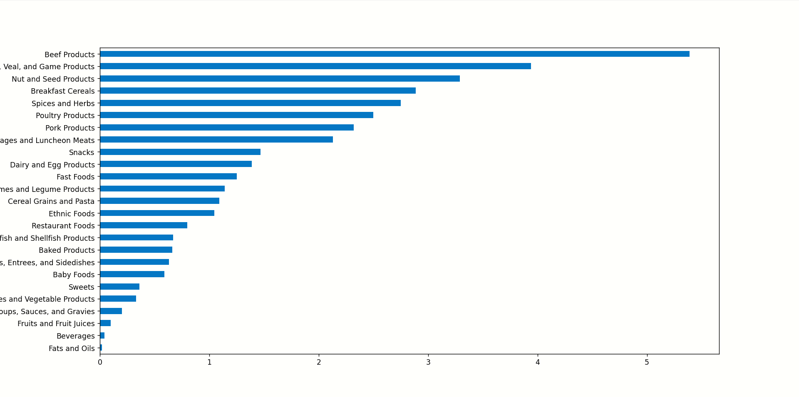

# 分析过程
通过读取dataset的第一条数据：
```python
{
  "id": 21441,
  "description": "KENTUCKY FRIED CHICKEN, Fried Chicken, EXTRA CRISPY,
Wing, meat and skin with breading",
  "tags": ["KFC"],
  "manufacturer": "Kentucky Fried Chicken",
  "group": "Fast Foods",
  "portions": [
    {
      "amount": 1,
      "unit": "wing, with skin",
      "grams": 68.0
    },

    ...
  ],
  "nutrients": [
    {
      "value": 20.8,
      "units": "g",
      "description": "Protein",
      "group": "Composition"
    },

    ...
  ]
}
```

发现营养成分这块嵌套了一个列表，里面是一个一个字典。这些数据是各个食物的详细信息以及拥有的细致的营养成分信息。因此可作以下分析：

- 查看某个营养成分在各类食物组中的中值
- 查看某类营养成分的细分类在什么食物中的含量最高

## 查看某个营养成分在各类食物组中的中值
- 先把数据放入dataframe。由于nutrients这个键的值是一个列表，与id、食物等不一样，所以不适合一开始就带着nutrients，先把"description", "group", "id", "manufacturer"这几个合适的放入dataframe中（利用columns=info_keys控制），然后把nutrients放入另一个，再把两张表合并
- 以"nutrient",和"fgroup"作为分组依据，用quantile(0.5)返回各个组值的中位数，这是一条有二级索引的Series数据，再传入索引如["Zinc, Zn"]，即可查看这类营养物质在各个食物中的中值：

## 查看某类营养成分的细分类在什么食物中的含量最高
- 以`['nutgroup','nutrient']`为分组，并定义一个函数返回每个组别的最大值即可；例如返回氨基酸类的细致组别：
```python
nutrient
Alanine                                                                            Gelatins, dry powder, unsweetened
Arginine                                                                                Seeds, sesame flour, low-fat
Aspartic acid                                                                                    Soy protein isolate
Cystine                                                                 Seeds, cottonseed flour, low fat (glandless)
Glutamic acid                                                                                    Soy protein isolate
Glycine                                                                            Gelatins, dry powder, unsweetened
Histidine                                                                 Whale, beluga, meat, dried (Alaska Native)
Hydroxyproline    KENTUCKY FRIED CHICKEN, Fried Chicken, ORIGINAL RECIPE, Wing, meat only, skin and breading removed
Isoleucine                                            Soy protein isolate, PROTEIN TECHNOLOGIES INTERNATIONAL, SUPRO
Leucine                                               Soy protein isolate, PROTEIN TECHNOLOGIES INTERNATIONAL, SUPRO
Lysine                                                           Seal, bearded (Oogruk), meat, dried (Alaska Native)
Methionine                                                                     Fish, cod, Atlantic, dried and salted
Phenylalanine                                         Soy protein isolate, PROTEIN TECHNOLOGIES INTERNATIONAL, SUPRO
Proline                                                                            Gelatins, dry powder, unsweetened
Serine                                                Soy protein isolate, PROTEIN TECHNOLOGIES INTERNATIONAL, SUPRO
Threonine                                             Soy protein isolate, PROTEIN TECHNOLOGIES INTERNATIONAL, SUPRO
Tryptophan                                                          Sea lion, Steller, meat with fat (Alaska Native)
Tyrosine                                              Soy protein isolate, PROTEIN TECHNOLOGIES INTERNATIONAL, SUPRO
Valine                                                Soy protein isolate, PROTEIN TECHNOLOGIES INTERNATIONAL, SUPRO
Name: food, dtype: object
```

# 新应用
## quantile()
- 返回的是Sereis对象
# 注意
## 给dataframe数据一个新列赋值一个单一的值的广播
在 Pandas 中，当你为 DataFrame 的一个新列赋值一个单一的值（比如数字、字符串、布尔值等）时，Pandas 会自动执行广播（Broadcasting）操作，将这个值复制并填充到该列的每一行中。
```python
for rec in dataset:
    fnutr=pd.DataFrame(rec['nutrients'])
    fnutr['id'] = rec['id']
```
## DataFrame.info()
DataFrame.info() 方法不是通过 return 语句返回字符串形式的信息，而是直接将信息打印（输出）到控制台。
`print("info.info()cgnjcghn:\n",info.info(),sep="")`
会导致：
```python
<class 'pandas.core.frame.DataFrame'>
RangeIndex: 6636 entries, 0 to 6635
Data columns (total 4 columns):
 #   Column        Non-Null Count  Dtype 
---  ------        --------------  ----- 
 0   description   6636 non-null   object
 1   group         6636 non-null   object
 2   id            6636 non-null   int64 
 3   manufacturer  5195 non-null   object
dtypes: int64(1), object(3)
memory usage: 207.5+ KB
info.info()cgnjcghn:
None
```
## 根据json格式数据的特点选择读取方式
在Bitly的数据中，一条数据占一行，所以获取的数据是一条一条地放进列表：
```python
records = [json.loads(line) for line in f]
```

而在本次分析的数据中，所有数据只占一行，放在一个列表中，所以以以下方式读取
```dataset=json.load(open(path))```